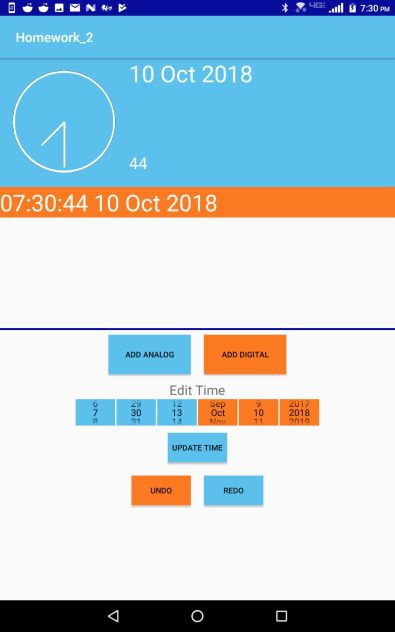
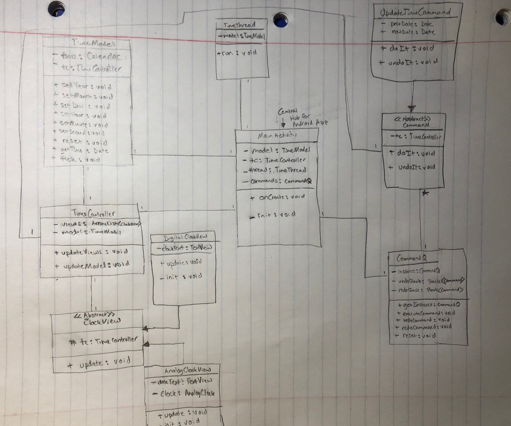

# Homework 2

##### CEG 4110-01

##### Nathan Dunn

 [*github repository*](https://github.com/natedunn2230/Homework_2)

## Overview

This assignment gave me the opportunity to implement design patterns discussed in class. These include Model View Controller (MVC), Command and Singleton design pattens. This application allows the user to instantiate multiple views of clocks (analog or digital) and update their time. The user also has the choice to undo or redo any changes they made.

## Screenshot

## Deployment Instructions

*Deployment does not rely on extra resources*

1. Connect an android device to the computer and run in File Transfer Mode (MTP).
2. On the android device, go to settings->security and make sure Unknown sources is turned on. This allows the device to install apps from unknown sources, such as this application.
3. After extracting Homework_2_ndunn.tar.gz, Drag Homework_2.apk into the root directory of the android device.
4. On the android device, go to Files/File Manager. Under the root directory, Homework_2.apk should be visible. Click on it and open it to start the installation process.
5. Once the installation process is complete, proceed to the application instructions.

## UML Diagram

## Libraries 

An open source library was used for the [analog clock](https://github.com/rosenpin/custom-analog-clock-view).